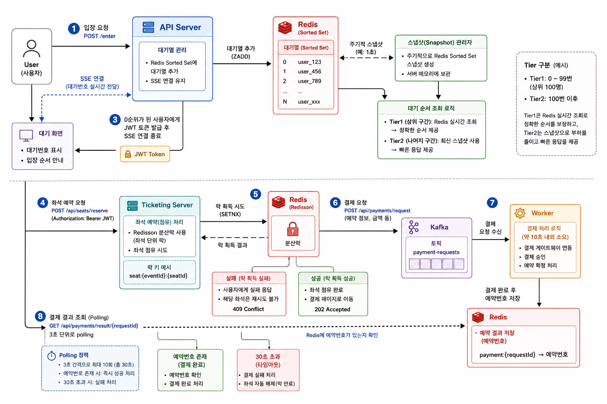

# NO24 - Concert Ticketing System

대규모 동시 접속을 처리하는 콘서트 티켓팅 시스템입니다. 대기열 관리, 좌석 예약, 결제 처리를 마이크로서비스 아키텍처로 구현했습니다.

---

## 아키텍처 개요

---

## 전체 처리 흐름

### Step 1 — 대기열 입장
유저가 `GET /enter?event_id=&user_id=` 로 API Server에 접속한다. SSE 연결이 수립되고, Redis Sorted Set(`waiting:{event_id}`)에 삽입 시각(UnixNano)을 score로 유저를 등록한다.

### Step 2 — 대기 순위 전송 (2-Tier 최적화)
SSE 연결 중 3초 간격으로 현재 순위를 유저에게 전송한다. Redis 부하를 줄이기 위해 순위 조회에 2-Tier 전략을 적용한다.

| Tier | 대상 | 순위 조회 방법 |
|---|---|---|
| **Tier 1** | 상위 100명 또는 상위 1% | Redis 직접 조회 → 정확한 순위 |
| **Tier 2** | 나머지 | 1분 주기 인메모리 스냅샷 → 근사 순위 |

### Step 3 — JWT 토큰 발급
`waitingQueueWorker`가 Redis ZSet에서 FIFO(ZPopMin)로 유저를 꺼낸다. `user_id`·`event_id` 클레임이 담긴 RS256 JWT(유효 10분)를 생성한 뒤 SSE로 전달한다. 해당 유저가 다른 replica에 연결된 경우 Kafka(`wait-queue-events`)로 브로드캐스트하여 해당 replica가 SSE로 전달하도록 한다. 토큰 수신 후 SSE 연결은 종료된다.

### Step 4 — 좌석 예약
유저는 JWT를 `Authorization: Bearer` 헤더에 담아 `POST /api/seats/reserve`를 호출한다.

- Ticketing Server는 Spring Security OAuth2 Resource Server로 JWT를 검증한다.
- Redisson `tryLock(0, 0, SECONDS)` — 비차단 분산 락으로 좌석을 선점한다.
  - 선점 실패(이미 예약된 좌석) → 409 반환, 재시도 불가
  - 선점 성공 → Redis MapCache에 10분 TTL로 예약 정보 저장, `reservationId`(UUID) 반환

### Step 5 — 결제 요청 (Kafka 발행)
유저가 `POST /api/payments/request`를 호출하면 `PaymentRequestedEvent`를 Kafka 토픽(`ticketing.payment.requested`)에 발행하고 202 Accepted를 반환한다.

### Step 6 — 결제 처리 (Kafka Consumer)
`PaymentProcessor`가 Kafka 이벤트를 소비한다. PG 결제 처리를 시뮬레이션(7~13초 소요)하고, 완료된 결과(`PaymentResultEvent`)를 Redis에 저장한다.

```
Redis Key : payment:result:{reservationId}
Value     : PaymentResultEvent JSON (성공 여부, 처리 시각 등)
TTL       : 10분
```

### Step 7 — 결제 결과 폴링
유저는 `GET /api/payments/status/{reservationId}`를 **3초 간격**으로 폴링한다.

| 응답 | 의미 |
|---|---|
| `202 Accepted` | 아직 처리 중 → 계속 폴링 |
| `200 OK` + `success: true` | 결제 완료 |
| `200 OK` + `success: false` | 결제 실패 |

**30초 이상 202가 지속되면 클라이언트에서 타임아웃 실패 처리**한다.

---

## 서비스 구성 (Monorepo)

| 서비스 | 언어/프레임워크 | 역할 |
|---|---|---|
| `api-server` | Go 1.25 + Echo v5 | 대기열 관리, 순번 발급, JWT 발행 |
| `ticketing-server` | Java 21 + Spring Boot 4.0 | 좌석 예약, 결제 처리, 결제 결과 조회 |

---

## 기술 스택

### Infrastructure
- **Kafka** — 서비스 간 이벤트 스트리밍 및 replica 간 SSE 토큰 브로드캐스트
- **Redis** — 대기열 Sorted Set, 분산 락(Redisson), 좌석 예약 캐시, 결제 결과 저장
- **MySQL** — 이벤트(공연) 정보 영구 저장
- **Kubernetes** — 전체 인프라 오케스트레이션

### API Server (Go)
- Echo v5 — HTTP 라우터
- SSE — 대기 순위 및 JWT 토큰 실시간 전송
- Kafka Go client — 토큰 브로드캐스트 (다중 replica 동기화)
- Redis Sorted Set — 대기열 FIFO 관리 + 2-Tier 스냅샷 캐시
- AWS Secrets Manager — 프로덕션 환경 RSA 키 로딩

### Ticketing Server (Java)
- Spring Security + OAuth2 Resource Server — Bearer JWT 검증 (JWKS 원격 조회)
- Redisson — 좌석별 RLock 분산 락 + RMapCache 예약 캐시
- Spring Kafka — 결제 이벤트 Producer / Consumer (concurrency=1, 순차 처리)
- Redis RBucket — 결제 결과 저장 (10분 TTL)

---

## API Reference

### API Server

| Method | Path | 설명 |
|---|---|---|
| `GET` | `/enter` | 대기열 입장 + SSE 연결 (`?event_id=&user_id=`) |
| `GET` | `/.well-known/jwks.json` | RSA 공개 키 (JWKS 형식) |

**SSE 이벤트 포맷 (3초 간격 순위 전송):**
```json
{"seq": 42}
```

**SSE 이벤트 포맷 (대기열 통과 시 — 연결 종료):**
```json
{"seq": 1, "token": "<jwt_token>"}
```

---

### Ticketing Server

모든 엔드포인트는 `Authorization: Bearer {jwt_token}` 헤더가 필요합니다.

| Method | Path | 설명 |
|---|---|---|
| `POST` | `/api/seats/reserve` | 좌석 예약 (분산 락 선점) |
| `POST` | `/api/payments/request` | 결제 요청 접수 (Kafka 발행) |
| `GET` | `/api/payments/status/{reservationId}` | 결제 결과 폴링 |

**좌석 예약 응답 (200 OK):**
```json
{
  "success": true,
  "message": "좌석 확보에 성공했습니다.",
  "data": {
    "reservationId": "550e8400-e29b-41d4-a716-446655440000",
    "seatId": "A1"
  }
}
```

**좌석 예약 실패 (409 Conflict):**
```json
{"success": false, "message": "좌석 확보에 실패했습니다.", "data": null}
```

**결제 요청 응답 (202 Accepted):**
```json
{
  "success": true,
  "message": "결제 요청이 접수되었습니다.",
  "data": {"reservationId": "550e8400-..."}
}
```

**결제 결과 폴링 — 처리 중 (202 Accepted):**
```json
{"success": true, "message": "결제 처리 중입니다.", "data": null}
```

**결제 결과 폴링 — 완료 (200 OK):**
```json
{
  "success": true,
  "message": "결제가 완료되었습니다.",
  "data": {
    "reservationId": "550e8400-...",
    "processedAt": "2026-06-05T12:34:56.789Z"
  }
}
```

---

## 주요 설계 결정

### 대기열 2-Tier 스냅샷
- 수십만 명이 대기 중일 때 3초마다 전원 Redis 조회 시 부하 폭증
- 상위 소수(Tier 1)만 실시간 조회하고, 나머지(Tier 2)는 1분 주기 인메모리 스냅샷 활용
- 클라이언트 체감 지연 없이 Redis 부하를 대폭 절감

### 결제 결과 Redis 폴링
- SSE 연결 유지 방식 대비 서버 자원 절약 (커넥션 풀 절감)
- Kafka Consumer가 처리 완료 즉시 `payment:result:{reservationId}`에 저장(TTL 10분)
- 클라이언트는 3초 간격 폴링, 30초 타임아웃으로 실패 처리
- 결제 처리는 7~13초 소요(PG 시뮬레이션)되므로 폴링 3~5회 이내에 결과 수신

### 분산 락 (Redisson RLock)
- 좌석별 `ticketing:lock:seat:{seatId}` 키로 락 적용
- `tryLock(0, 0, SECONDS)` — 대기 없이 즉시 실패, 재시도 없음
- 이중 예약 완전 방지, 동시 요청 수백 건에도 단 한 건만 선점 성공

### Kafka 토큰 브로드캐스트
- API Server replica가 여러 개일 때 JWT 발급 인스턴스 ≠ SSE 연결 인스턴스 가능
- 발급 인스턴스가 `wait-queue-events` 토픽에 발행 → 모든 replica가 소비하여 자신의 SSE 허브 검색
- hostname 기반 GroupID로 각 replica가 동일 메시지를 모두 수신 (fan-out)

---

## 데이터베이스 스키마

```sql
CREATE TABLE events (
    id         INT PRIMARY KEY,
    name       VARCHAR(50) UNIQUE,   -- e.g. "bts_2026_seoul"
    status     ENUM('A', 'N'),       -- Active / Inactive
    start_at   TIMESTAMP,
    end_at     TIMESTAMP,
    created_at TIMESTAMP,
    updated_at TIMESTAMP
);
```

---

## Redis 키 목록

| 키 패턴 | 자료구조 | TTL | 용도 |
|---|---|---|---|
| `waiting:{event_id}` | Sorted Set | 없음 | 대기열 (score = 삽입 시각 UnixNano) |
| `ticketing:seat:reservations` | RMapCache | 10분 | 좌석 예약 정보 |
| `ticketing:lock:seat:{seatId}` | RLock | 없음 | 좌석 분산 락 |
| `payment:result:{reservationId}` | RBucket(String) | 10분 | 결제 결과 (JSON) |

---

## 인프라 구성 (Kubernetes)

```
infra/
├── kafka-service.yaml          # Kafka StatefulSet (1 replica)
├── redis-service.yaml          # Redis Deployment + PVC (1Gi)
├── mysql-service.yaml          # MySQL StatefulSet + PVC (5Gi)
├── api-server/
│   └── deployment.yaml         # replicas: 2, LoadBalancer:80 → 8080
└── ticketing-server/
    └── deployment.yaml         # replicas: 2, LoadBalancer:81 → 8081
```

| 컴포넌트 | 타입 | 포트 | 스토리지 |
|---|---|---|---|
| api-server | Deployment (×2) | 80 → 8080 | - |
| ticketing-server | Deployment (×2) | 81 → 8081 | - |
| Kafka | StatefulSet (×1) | 9092 | - |
| Redis | Deployment | 6379 | 1Gi PVC |
| MySQL | StatefulSet | 3306 | 5Gi PVC |

---

## 프로젝트 구조

```
no24/
├── api-server/
│   ├── cmd/main.go                     # 엔트리포인트
│   ├── internal/
│   │   ├── mq/client.go               # Kafka 클라이언트 (브로드캐스트 / 수신)
│   │   ├── queue/
│   │   │   ├── repository.go          # Redis 대기열 CRUD + 2-Tier 스냅샷
│   │   │   ├── snapshot.go            # 인메모리 스냅샷 (RBMutex)
│   │   │   └── events.go              # 이벤트 로딩 (MySQL)
│   │   ├── service/service.go         # JWT 발급, waitingQueueWorker
│   │   ├── sse/sse.go                 # SSE Hub (goroutine 기반)
│   │   └── model/                     # 데이터 모델
│   ├── no24_api_Dockerfile
│   └── go.mod
│
├── ticketing-server/ticketing/src/main/java/com/ticketing/ticketing/
│   ├── controller/TicketingController.java
│   ├── seat/
│   │   ├── SeatReservationService.java  # Redisson 분산 락 + RMapCache
│   │   └── SeatReservation.java
│   ├── payment/
│   │   ├── PaymentProducer.java         # Kafka 발행
│   │   ├── PaymentProcessor.java        # Kafka 소비 → 결제 처리 → Redis 저장
│   │   ├── PaymentResultStore.java      # Redis RBucket 읽기/쓰기
│   │   └── PaymentResultEvent.java
│   ├── kafka/PaymentRequestedEvent.java
│   ├── auth/
│   │   ├── JwtAuthenticationFilter.java
│   │   └── JwtTokenProvider.java
│   ├── notification/PushNotificationService.java
│   └── config/
│       ├── KafkaConfig.java
│       ├── RedissonConfig.java
│       ├── SecurityConfig.java
│       └── AppProperties.java
│
├── database_schema/schema.sql
├── infra/
└── .github/workflows/
    ├── docker-push.yml             # CI/CD (조건부 빌드 + 이미지 태그 자동 업데이트)
    └── security-audit.yml          # PR 시 AI 기반 보안 감사
```

---

## 부하 테스트

`ticketing-server/ticketing/src/main/resources/static/stress-client.html`을 브라우저에서 열면 E2E 스트레스 테스트를 실행할 수 있습니다.

**테스트 시나리오 (유저 1명 기준):**
1. SSE 연결 → 대기열 입장 → JWT 수신
2. JWT로 좌석 예약 → `reservationId` 획득
3. 무작위 대기 후 결제 요청 (202 Accepted)
4. 3초 간격 폴링 → 결제 완료/실패 확인 (30초 타임아웃)

**측정 지표:** JWT 획득 수, 좌석 예약 수, 결제 완료 수, 실패 수, 각 단계별 평균 지연
